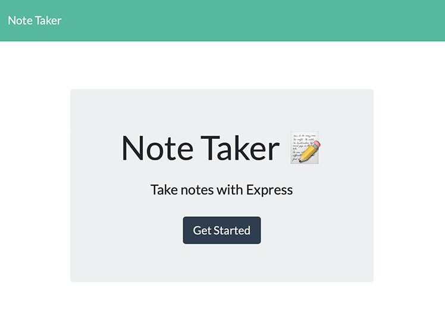

# Note-Taker
Write and save notes to keep track of tasks

UCLA Bootcamp Challenge  - Module 11

Due Date 11/01/2022

## Challenge Tasks

Create an application that can be used to write and save notes. Use Express.js back end and save and retrieve note data from JSON file.

## User Story

```
AS A small business owner
I WANT to be able to write and save notes
SO THAT I can organize my thoughts and keep track of tasks I need to complete
```

## Requirements
- Given a note-taking application
- When I open the Note Taker I am presented with a landing page with a link to a get started with a note.

The following image shows the note taker landing page and link to take notes:


- once clicked on the get started then I am presented with a page that has existing notes listed on the left column
- I can enter a new note with title and note's text
- Clicking the save icon will add the note to the exisitng notes on the left column
- clicking on any of the notes on the left column will display it on the right column
- Note Taker navigation link will take you back to the home page
-This application will be deployed on Heroku

The following image shows the notes page:


## Deployedment

Note-Taker applicaiton was deployed using Heroku and can be found: [here](https://serene-retreat-00987.herokuapp.com/)

ReRepository for Note-Taker application can be found at: [GitHub](https://github.com/Me-ross/team-profile/Note-Taker)